<p align="center">
  
</p>

<p align="center">
  
  
  
  
  
</p>

<h3 align="center">A tiny menu-bar app that stops your Mac from falling asleep. One click. Filled cup = awake. ☕</h3>

---

## The story (or: why this exists at all)

I wanted the classic coffee-cup-in-the-menu-bar thing. Easy, right? Except my **work laptop's MDM** had other plans:

1. Tried [**KeepingYouAwake**](https://github.com/newmarcel/KeepingYouAwake) → blocked.
2. Tried the classic **Caffeine** app → blocked.
3. Tried dropping a **LaunchAgent** → turns out the MDM had made `~/Library/LaunchAgents` *root-owned*. Blocked.

At that point it was personal. Downloaded apps get a quarantine flag and have to clear notarization + an endpoint-management allowlist — but a binary **you compile locally** has no quarantine flag and isn't a pre-built app the MDM recognizes. So I got bored, opened a `.swift` file, and wrote my own in ~120 lines.

**CaffeineOSS wasn't a real project.** It's not on Homebrew, it wasn't on GitHub, the name didn't exist. I just built it because I was bored and the corporate firewall made me angry. Now it's here. ☕

---

## What it actually does

When you flip it on, CaffeineOSS does exactly what you'd type by hand — nothing exotic, just Apple's own tools:

```bash
caffeinate -dimsu              # prevent display / idle / disk / system sleep + keep "user active"
sudo pmset -a disablesleep 1   # also stop the forced sleep that happens when you CLOSE THE LID
```

- It launches `caffeinate -dimsu` as a child process and keeps it alive for as long as you're awake.
- It flips `pmset disablesleep` so the Mac **stays awake even with the lid shut** (great for leaving `claude` running overnight). That part needs root, so you get **one native admin prompt per toggle**.

Everything is undone the moment you toggle off, when a timer expires, or when you quit — so the laptop sleeps normally again the second you're done.

> [!NOTE]
> The first cut of this app only held a single `PreventUserIdleDisplaySleep` IOKit assertion (== `caffeinate -d`). That keeps the screen on while the lid is **open**, but the Mac still sleeps the instant you close the lid. `disablesleep` is the only thing that defeats clamshell sleep — which is why the lid-closed case now works.

- 🟤 **Outline cup** = sleep allowed (normal)
- ☕ **Filled cup** = staying awake (lid open *and* closed)
- ⏱ **Timed modes** — awake for 30 min / 1 h / 2 h / 5 h, then auto-off
- 🪶 **Featherweight** — one Swift file, zero dependencies, no Dock icon (menu-bar only)

---

## Install (build it yourself — that's the whole point)

You need the Xcode Command Line Tools (`xcode-select --install`). Then:

```bash
git clone https://github.com/kuberwastaken/caffeineOSS.git
cd caffeineOSS
./build.sh
open CaffeineOSS.app
```

`build.sh` compiles `main.swift`, wraps it in a proper `.app` bundle, and **ad-hoc signs it locally** — so there's no quarantine flag for an MDM/Gatekeeper to choke on.

> [!TIP]
> Because you compiled it yourself, there's no `com.apple.quarantine` attribute and nothing for notarization gates to reject. This is exactly why it runs where the prebuilt apps didn't.

---

## Start at login (survives reboots)

The clean way is a LaunchAgent — but if your MDM has locked down `~/Library/LaunchAgents` (mine had), use the per-user **Login Items** list instead, which doesn't need that directory:

```bash
osascript -e 'tell application "System Events" to make login item at end with properties {path:"'$PWD'/CaffeineOSS.app", hidden:true, name:"CaffeineOSS"}'
```

Verify it took:

```bash
osascript -e 'tell application "System Events" to get name of every login item'
```

You can also do this by hand in **System Settings → General → Login Items → +**.

---

## Uninstall

```bash
# stop it
osascript -e 'quit app "CaffeineOSS"'
# remove from login items
osascript -e 'tell application "System Events" to delete login item "CaffeineOSS"'
# delete the build
rm -rf CaffeineOSS.app
```

---

## No-install fallback

If even a locally-built app gets blocked, macOS ships the original. Zero install, zero app:

```bash
caffeinate -d        # keep display awake until Ctrl-C
caffeinate -t 3600   # awake for 1 hour
caffeinate make      # awake until `make` finishes
```

CaffeineOSS is really just a friendly coffee cup glued on top of that idea.

---

## Project layout

```
caffeineOSS/
├── main.swift        # the entire app (~120 lines)
├── build.sh          # compile → .app bundle → ad-hoc sign
├── assets/
│   └── banner.svg    # the cup up top
└── README.md
```

---

## License

MIT — see [LICENSE](LICENSE). Do whatever you want with it. ☕

<p align="center"><sub>Built because I was bored and the corporate firewall made me angry.</sub></p>
